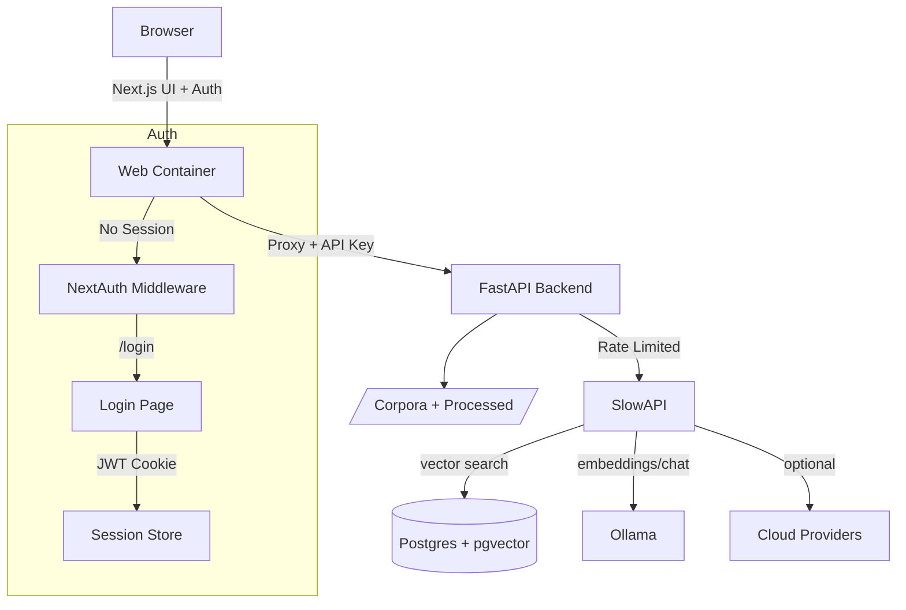

# Architecture Overview

## Components

| Component | Technology | Purpose |
|-----------|------------|---------|
| **Frontend** | Next.js 14, React, Tailwind CSS | UI for chat, library, ingest, eval |
| **Backend** | FastAPI, Python 3.12 | REST API for all operations |
| **Database** | PostgreSQL 16 + pgvector | Vector storage and document metadata |
| **LLM Engine** | Ollama (local) | Embeddings and chat completions |
| **Authentication** | NextAuth.js | Frontend login, JWT sessions |
| **Rate Limiting** | SlowAPI | API request throttling |

## Data Flow

```
User Browser → Next.js UI → API Proxy (inject API key) → FastAPI Backend
                                                      ↓
                                         ┌────────────────────────────┐
                                         │  Ingest / Retrieve / Chat │
                                         └────────────────────────────┘
                                                      ↓
                              ┌─────────────────┬─────────────┴─────────────┐
                              ↓                 ↓                         ↓
                        pgvector DB     Ollama (embed/chat)      File System
                     (embeddings)     (local models)            (corpora/processed)
```

## Authentication Flow

```
Browser → Middleware → Protected Route
  ↓                    ↓
/login ←──── No Session ──→ Allow
  ↓
NextAuth.js Credentials Provider
  ↓
Validate NEXUS_PASSWORD
  ↓
Set JWT Session Cookie (24h)
  ↓
Redirect to original destination
```

## Rate Limiting

| Endpoint Group | Limit | Window |
|---------------|-------|--------|
| All API routes | 100 | requests/hour |
| Chat endpoints | 10 | requests/minute |

Implemented via SlowAPI with Redis-style key function (client IP).

## Security Layers

1. **Frontend**: NextAuth.js middleware protects all routes except `/login` and `/api/auth/*`
2. **API**: All routes require `x-api-key` header
3. **CORS**: Configurable allowlist via `NEXUS_ALLOW_ORIGINS`
4. **File Serving**: Only corpus roots and `/processed` accessible
5. **Rate Limiting**: SlowAPI prevents brute force

## Storage

| Path | Type | Purpose |
|------|------|---------|
| `/corpora/{collection}` | bind mount | Source PDFs (read-only) |
| `/processed/{collection}` | volume | OCR output PDFs |
| `pgdata` | volume | PostgreSQL data |
| `ollama` | volume | Ollama model cache |

## Configuration

- Environment variables with `NEXUS_` prefix
- See `.env.example` for all options
- Collection definitions in `corpora.yml`


